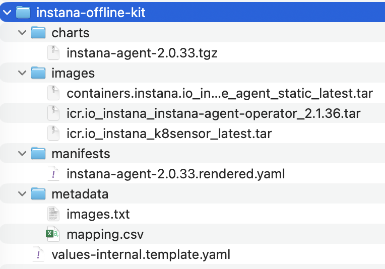

# Instana agent in a real Redhat Openshift airgapped environment

What does that mean?

Well, the sysadmin/devops/platform engineer/SRE (you name it) needs to install the Instana agent on a Redhat OpenShift cluster but that environment doesn't have access to Internet, not even to a Bastion host...maybe because strict regulations.

That means the agent needs to be installed using other methods and for that we need to build a full Instana agent offline package.

## Disclaimer
The guide assumes the reader has some Linux and OCP knowledge, "it works in my machine" and it's far from perfect but with the examples below it should work, if you have any improvements please create a PR.

## Preparation

**IMPORTANT**: It takes a while for the script to complete because the size of the images... isn't something that is real quick, just wait until the command completes, if you want to see details run the script with `bash -x`.

```shell
-rw-r--r--. 1 user root 1444824576 Oct 10 13:44 containers.instana.io_instana_release_agent_static_latest.tar
-rw-r--r--. 1 user root  166039040 Oct 10 13:44 icr.io_instana_instana-agent-operator_2.1.36.tar
-rw-r--r--. 1 user root  140064768 Oct 10 13:44 icr.io_instana_k8sensor_latest.tar
```

Install skopeo

Ensure you do a `oc login`

Registry route is not exposed or not ready

Check if it's there:

```shell
oc get route default-route -n openshift-image-registry
```

If not, enable it:

```shell
oc patch configs.imageregistry.operator.openshift.io/cluster \
  --type merge -p '{"spec":{"defaultRoute":true}}'
```

Verify:

```shell
oc get route default-route -n openshift-image-registry
NAME            HOST/PORT                                                                                   PATH   SERVICES         PORT    TERMINATION   WILDCARD
default-route   default-route-openshift-image-registry.apps.domain.com          image-registry   <all>   reencrypt     None
```

Check if it responds:

```shell
curl -vk https://default-route-openshift-image-registry.apps.domain.com/v2/
```

If it says this even if you don't authenticate then you're safe:

```shell
*   Trying 159.122.233.213:443...
* Connected to default-route-openshift-image-registry.apps.68d3e6292458e08928492fc6.eu1.techzone.ibm.com (159.122.233.213) port 443 (#0)
```

## Scripts

There are two scripts and they were tested on Redhat Linux Enterprise 9.x:

### instana-agent-offline-preparation.sh

Use this script to prepare all files and configuration needed to install the Instana agent, it will create an `instana-offline-kit` directory with all you need.

Run this script from a Linux machine that has access to the Internet. Read the script for more options but you can just change the values on `USER CONFIG` where needed (ideally just on `Desired labeling used...`) and on `Values template knobs (used when writing values-internal.template.yaml)`, you're safe if you run the command below:

```shell
./instana-agent-offline-preparation.sh   --method docker   --pull-arch amd64   --save-with-skopeo   --out-dir ./instana-offline-kit --instana-agent-key 'YOUR_AGENT_KEY'
```

If everything runs fine, you should have the following directory structure:



### instana-agent-offline-importer.sh

Use this script to install the Instana agent into the Redhat Openshift cluster without the need of the Internet nor Bastion host (Real Airgapped environment).
You need to select your `engine` either `podman` or `skopeo` to install the images, there is an `auto` option and that defaults to `podman`.

Command (modify the values to your environment):

```shell
./instana-agent-offline-importer.sh   --kit-dir ./instana-offline-kit   --namespace instana-agent   --cluster-name CP4BA_IO   --zone-name DarkZone   --endpoint-host ingress-red-saas.instana.io   --endpoint-port 443   --agent-tag latest   --sensor-tag latest   --operator-tag 2.1.36   --agent-key YOUR_AGENT_KEY --agent-repo-name static --engine skopeo
```

If you want to see what's happening (debug mode) just run the script with `bash -x`.

If everything runs without problems, you should see something like this at the end:

```shell
>>> Pods in instana-agent:
NAME                                                READY   STATUS    RESTARTS   AGE
instana-agent-2vsvg                                 1/1     Running   0          10s
instana-agent-4vm5w                                 1/1     Running   0          10s
instana-agent-controller-manager-67f5d7c565-pp7gq   1/1     Running   0          13s
instana-agent-fh5hc                                 1/1     Running   0          10s
instana-agent-k8sensor-7df947857c-7d7z2             1/1     Running   0          10s
instana-agent-k8sensor-7df947857c-d47zv             1/1     Running   0          10s
instana-agent-k8sensor-7df947857c-zd8zp             1/1     Running   0          10s
instana-agent-qk5gv                                 1/1     Running   0          10s
instana-agent-qt7ds                                 1/1     Running   0          10s
instana-agent-t9qhr                                 1/1     Running   0          10s
>>> DONE. Verify with: oc -n instana-agent get pods
```

### Troubleshooting

If something goes side ways, just uninstall the Instana agent by deleting the `instana-agent` project on OpenShift UI.

And most likely the Instana CR stays in "Terminating", just run:

```shell
oc patch agent instana-agent -n instana-agent \
  --type=merge -p '{"metadata":{"finalizers":[]}}'
```

The Instana agent should be removed and you can try the installation again.

If you see any `instana-agent` POD in `ErrImagePull`, just delete the POD and it will recreate.
