# MuleSoft Anypoint Hello World app with Opentelemetry for IBM Instana

## Prologue

A long time ago, a customer wanted to send Opentelemetry data from their apps running on MuleSoft Anypoint but there was no support from MuleSoft, after a while there was something out but didn't work as expected and now I got another request about this and decided to give it another try, number 3 should work, right?

## What's needed?

To have the so much needed monitoring you're required to get a MuleSoft Anypoint subscription, starting from Advanced and beyond you get this value out of the box, but, we're testing and we need to prove that Opentelemetry from those MuleSoft Anypoint apps work with Instana, and this approach should work for any type of subscription. Tested on Free tier subscription.

- You need the Instana Agent's key.
- You need the Instana Backend URL, [you can find yours here](https://www.ibm.com/docs/en/instana-observability/1.0.307?topic=instana-backend#endpoints-of-the-instana-backend-otlp-acceptor__title__1) depending on the region your SaaS Instana is located. Go to the three dots on the left hand side menu on Instana, "More"->"About Instana". Theoricatelly, this should work on Self-hosted but not tested.
- Read [Avio Consultings's Mule Opentelemetry Module documentation](https://avioconsulting.github.io/mule-opentelemetry-module/). Ignore the IBM part... IBM Instana supports Opentelemetry :)
- [Mule Opentelemetry Module Github](https://github.com/avioconsulting/mule-opentelemetry-module) for your reference.

NOTE: There are some limitations and it seems that the module support just Traces. Read the whole guide to see how this approach is going to benefit.

And... it's too much to read about and to understand, that's why you need something more human friendly to start with, like the Hello World below.

## Hello World from MuleSoft Anypoint

Pretty much dead and doesn't work, I needed to deconstruct it, re-engineer it and give it one more chance to showcase how to setup an app running on MuleSoft Anypoint to send Opentelemetry data to IBM Instana.

## Hello World for MuleSoft Anypoint with IBM Instana support

DISCLAIMER: It's far from perfect but is a good start for you to understand how the Mule Opentelemetry Module works and then go deeper to see what else you can do with it.

You need to clone this repo and just build it as it is:

```shell
mvn clean package -DskipTests
```

If everything went well you should see something like this at the end:

```shell
[INFO] Building zip: /IsReal8a/instana-examples/mule-app-hello-world-otel/target/hello-world-1.0.0-SNAPSHOT-mule-application.jar
[INFO] ------------------------------------------------------------------------
[INFO] BUILD SUCCESS
[INFO] ------------------------------------------------------------------------
[INFO] Total time:  3.590 s
[INFO] Finished at: 2025-10-30T12:03:22+01:00
[INFO] ------------------------------------------------------------------------
```
And you guessed, we need the `hello-world-1.0.0-SNAPSHOT-mule-application.jar` file.

## CloudHub 2.0 Application Properties

Now, we need to have the following ready for the application deployment (change the values based on your environment and application):

```shell
otel.collectorEndpoint = https://otlp-red-saas.instana.io:4318
otel.header.instana.key = YOUR_INSTANA_KEY    # mark Protected
OTEL_RESOURCE_ATTRIBUTES = service.name=hello-world,deployment.env=sandbox
```

## MuleSoft Anypoint

Go to "Runtimes" -> "Runtime Manager"

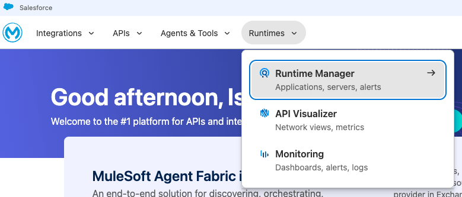

I'm going to use `sandbox`

Click on the "Deploy Application" button, give the application a name, upload the jar file and fill the fields on the "Properties" tab:

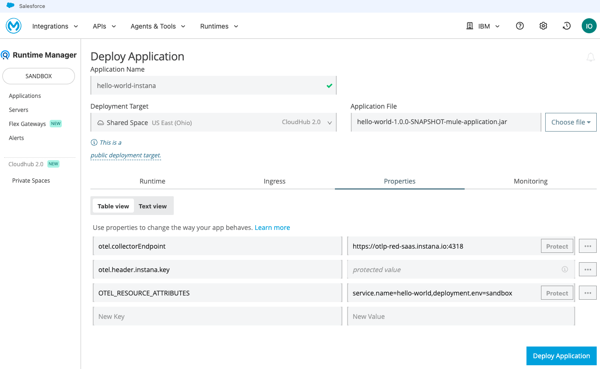

Click the "Deploy" button and wait a bit for the app to be up and running.

I had another app running, changed the name to "hello-world-instana2" and deployed it.

If everything went well, you should have something like this with the app in "Running" state.

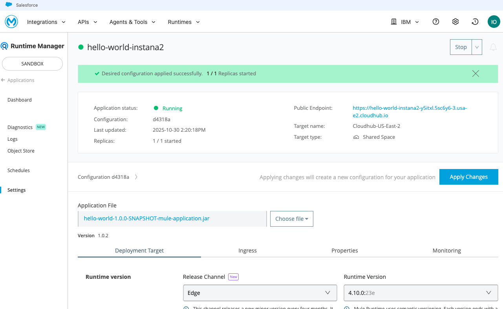

## Testing the App

Open the public endpoint with `/helloWorld`

https://yourapp.cloudhub.io/helloWorld

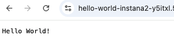

Reload it a few times just to send data to Instana.


## Searching the data on IBM Instana

Go to "Analytics" -> "Applications/Traces" and search by "Call.Type = HTTP" and DEST.Trace.ServiceName = "hello-world"

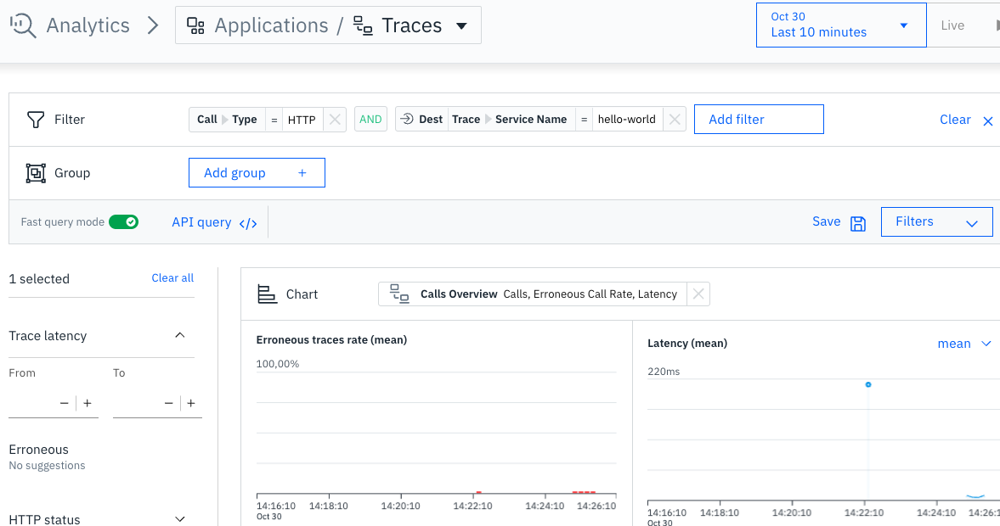

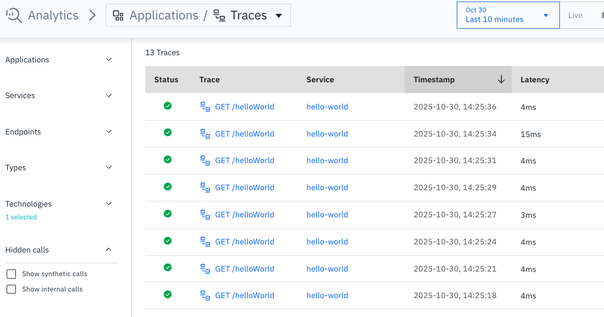

Remember that I told you I had another instance running, well, we can see them here:

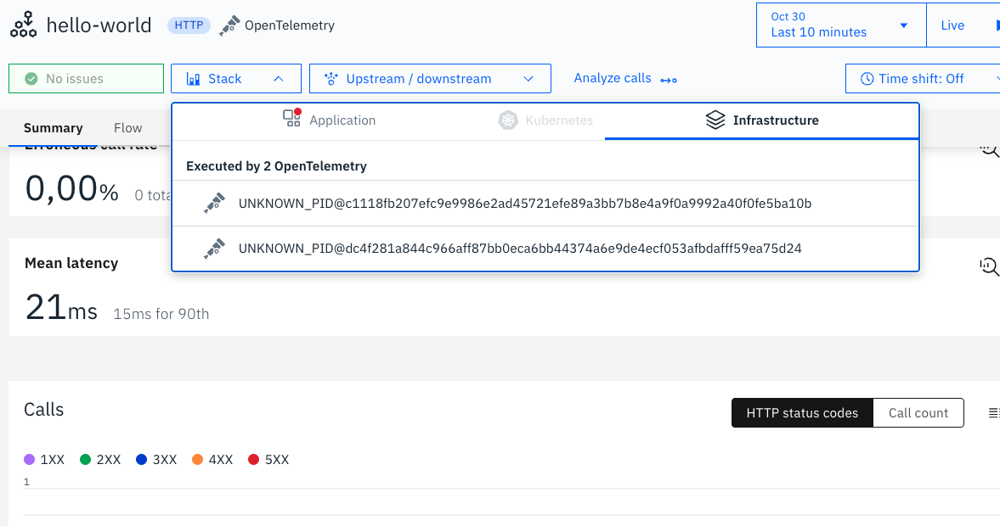

## Tracing details

### Tags

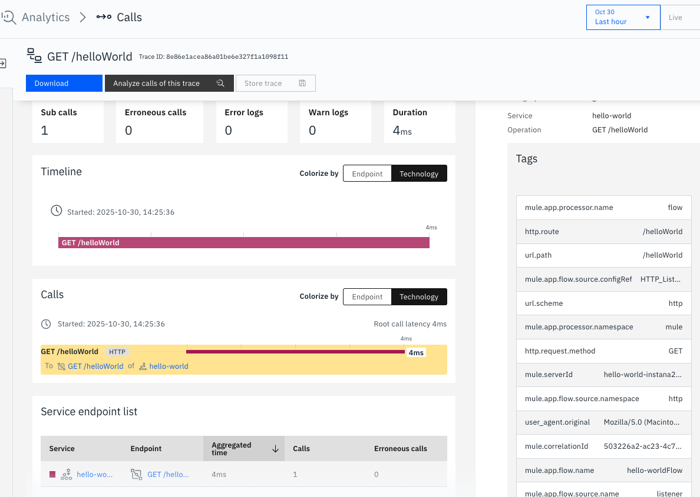

### Resource

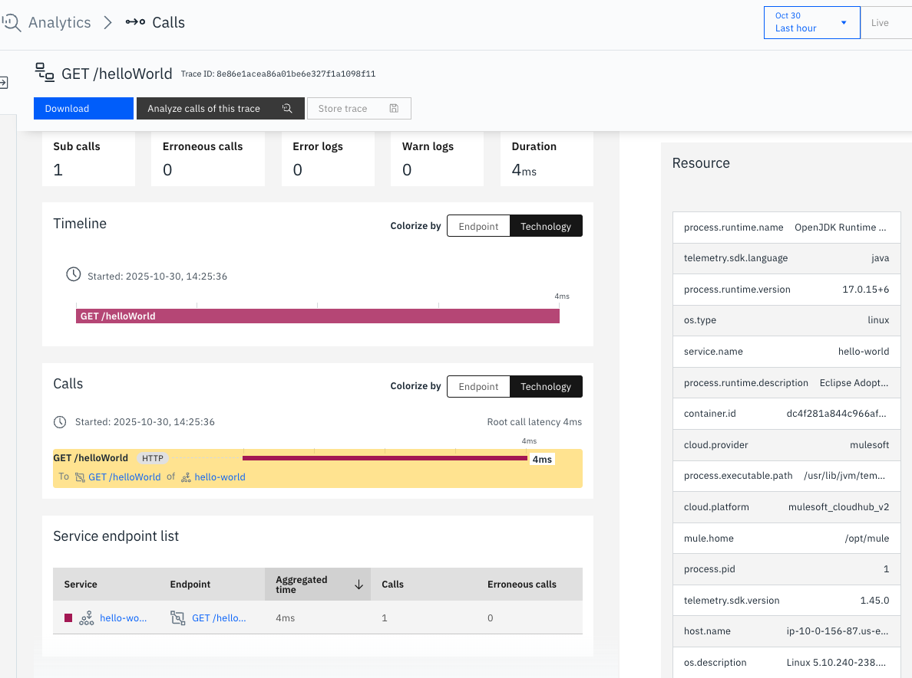

### Infrastructure

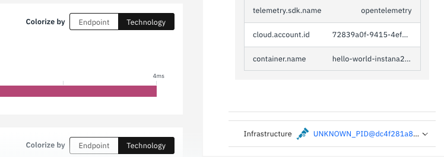

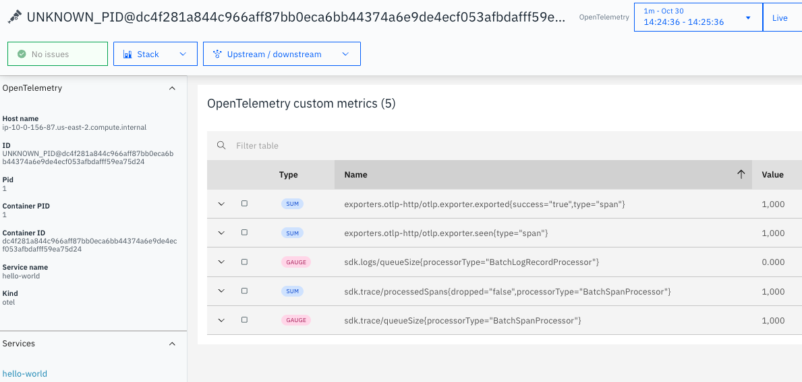

## Final thoughts

This is not perfect and are a few things that can be explored to make the experience better, but, for starters, this give you just the push you need to start monitoring your applications running on MuleSoft Anypoint with IBM Instana.
